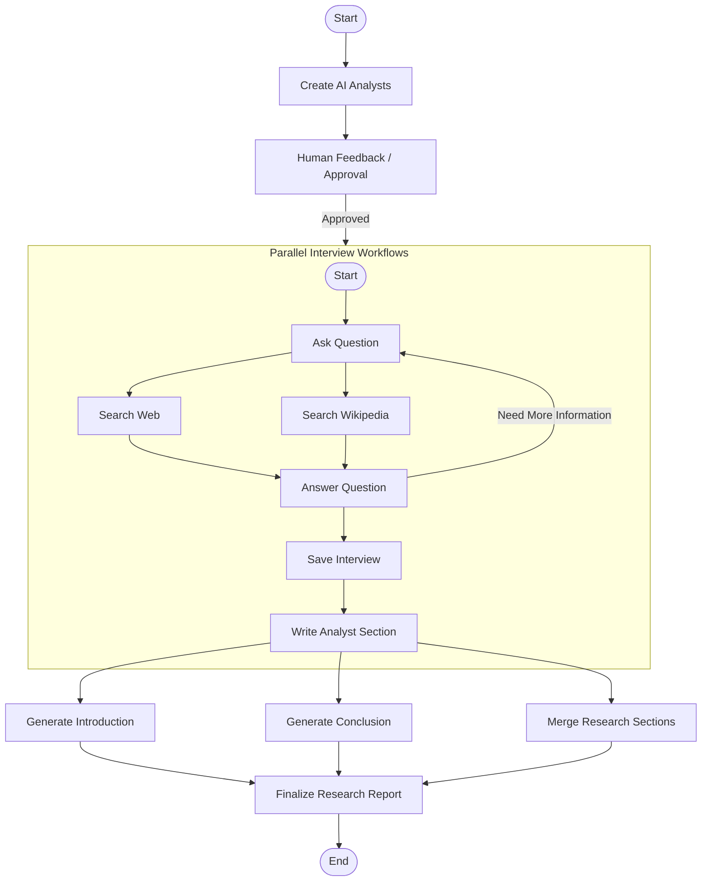
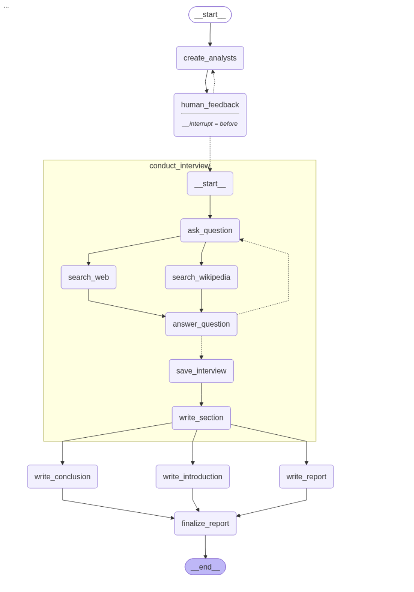
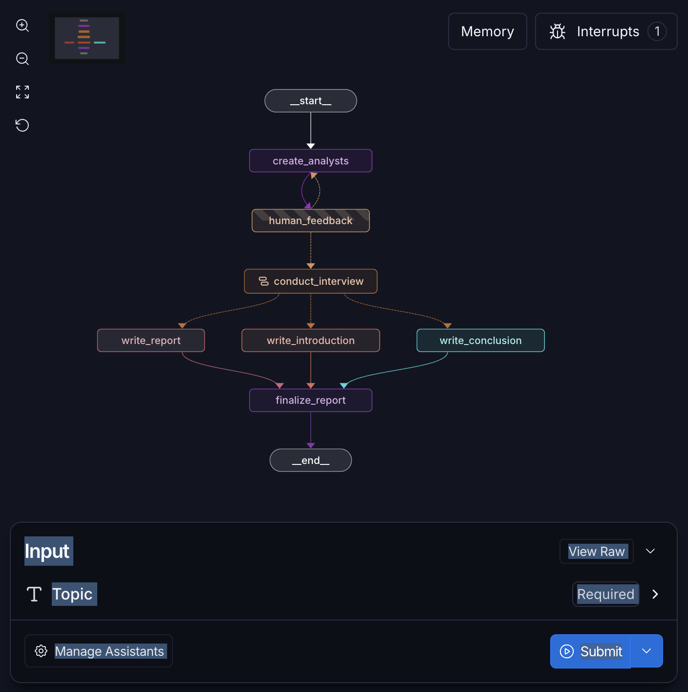
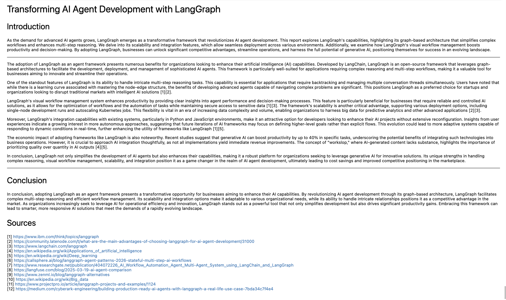

# 🔍 Multi-Agent Research Assistant

> A production-inspired AI research assistant built with **LangGraph**, **LangChain**, and **Large Language Models** that performs collaborative research through multiple AI analysts, human feedback, parallel interviews, and automated report generation.


---

# 📖 Overview

Traditional AI assistants rely on a single LLM response, which often limits research quality and diversity of perspectives.

This project introduces a **multi-agent research workflow** where multiple AI analysts collaboratively investigate a topic, conduct independent interviews, synthesize findings, and generate a structured research report.

The workflow includes:

- 👥 AI analyst generation
- ✋ Human-in-the-loop approval
- ⚡ Parallel analyst interviews
- 🌐 Web-based information gathering
- 🧠 Multi-agent reasoning
- 📝 Automated report synthesis
- 📚 Source attribution

The project demonstrates modern **agent orchestration** using **LangGraph** rather than a simple prompt chain.

---
# 🚀 Why This Project?

Most AI assistants rely on a single LLM response, which can limit the depth, reliability, and diversity of research. Complex research tasks often require exploring multiple perspectives, validating information from external sources, and organizing findings into a coherent report.

This project demonstrates how **LangGraph** can orchestrate a production-inspired **multi-agent workflow**, where multiple AI analysts independently investigate a topic, collaborate through parallel interview workflows, incorporate human feedback, and synthesize their findings into a structured research report with source attribution.

By leveraging graph-based orchestration instead of a linear prompt chain, the system provides a scalable, modular, and extensible architecture for building advanced AI research assistants.

# 🏗️ Architecture


---

# ✨ Features

### 🤖 Multi-Agent Collaboration

- Multiple AI analysts work independently
- Diverse analyst personas
- Parallel research execution

### 🔄 LangGraph Orchestration

- Graph-based workflow
- Typed state management
- Conditional routing
- Parallel execution using `Send()`

### 👨‍💻 Human-in-the-Loop

- Review generated analysts
- Modify analyst personas
- Approve before execution

### 📑 Automated Report Generation

The assistant automatically generates:

- Executive Introduction
- Individual analyst findings
- Combined insights
- Conclusion
- References & Sources

### 🌐 External Knowledge

Supports:

- Web Search
- Search APIs
- Document Retrieval
- LLM reasoning

### ⚡ Parallel Processing

Multiple interview agents execute simultaneously, reducing total execution time while improving research quality.

---

# 📂 Project Structure

```text
multi-agent-research-assistant/
│
├── graphs/
│   ├── research_graph.py
│   ├── interview_graph.py
│   └── state.py
│
├── agents/
│   ├── analyst.py
│   ├── interviewer.py
│   └── researcher.py
│
├── prompts/
│   ├── analyst_prompts.py
│   ├── interview_prompts.py
│   └── report_prompts.py
│
├── utils/
│   ├── helpers.py
│   ├── formatting.py
│   └── search.py
│
├── notebooks/
│
├── outputs/
│
├── images/
│
├── requirements.txt
├── .env.example
├── README.md
└── LICENSE
```

---

# ⚙️ Installation

## 1. Clone the repository

```bash
git clone https://github.com/SKR18156592/multi-agent-research-assistant.git

cd multi-agent-research-assistant
```

---

## 2. Create Virtual Environment

```bash
python -m venv .venv
```

Activate:

### Windows

```bash
.venv\Scripts\activate
```

### Linux / macOS

```bash
source .venv/bin/activate
```

---

## 3. Install Dependencies

```bash
pip install -r requirements.txt
```

---

## 4. Configure Environment

Create a `.env` file.

```bash
cp .env.example .env
```

---

# 🔑 Environment Variables

```env
OPENAI_API_KEY=your_api_key

TAVILY_API_KEY=your_api_key

LANGCHAIN_API_KEY=your_api_key

LANGCHAIN_PROJECT=Multi-Agent-Research

LANGCHAIN_TRACING_V2=true
```

---

# 🚀 Usage

Run the notebook or Python script.

Example:

```python
topic = "Future of Quantum Computing"

graph.invoke(
    {
        "topic": topic
    }
)
```

---

# 🔄 Workflow

## Step 1

Generate Analyst Personas

↓

## Step 2

Human reviews analysts

↓

## Step 3

Launch interview workflows in parallel

↓

## Step 4

Each analyst researches independently

↓

## Step 5

Interview reports are merged

↓

## Step 6

Generate introduction

↓

## Step 7

Generate conclusion

↓

## Step 8

Produce final report

---

# 📄 Example Output

```
Future of Quantum Computing

Introduction
--------------------------

Quantum computing is rapidly transforming...

------------------------------------------

Insights

Analyst 1
• Hardware challenges

Analyst 2
• Error correction

Analyst 3
• Industry adoption

Analyst 4
• Commercial outlook

------------------------------------------

Conclusion

Quantum computing continues to evolve...

------------------------------------------

Sources

• https://...
• https://...
• https://...
```

---

# 📸 Screenshots

## 🏗️ Workflow Architecture



---

## 📊 LangSmith Execution Trace



---

## 📄 Final Generated Report



---

# 🛠️ Technologies Used

| Technology | Purpose                   |
| ---------- | ------------------------- |
| Python     | Core language             |
| LangGraph  | Multi-agent orchestration |
| LangChain  | LLM framework             |
| OpenAI GPT | Reasoning                 |
| Tavily     | Web search                |
| Pydantic   | State validation          |
| LangSmith  | Debugging & tracing       |
| Jupyter    | Development               |


---

# 💡 Key Concepts Demonstrated

- Multi-Agent Systems
- Graph-Based AI Workflows
- Human-in-the-Loop AI
- State Management
- Parallel Execution
- Prompt Engineering
- LLM Orchestration
- Report Synthesis

---

# 🎯 Future Improvements

- [ ] Streamlit Web Interface
- [ ] FastAPI REST API
- [ ] Docker Support
- [ ] CI/CD with GitHub Actions
- [ ] Unit Tests
- [ ] Persistent Checkpoints
- [ ] Multi-LLM Support
- [ ] Local Model Support (Ollama)
- [ ] PDF Report Export
- [ ] Vector Database Memory
- [ ] Evaluation Metrics
- [ ] Live Streaming Responses

---

# 🤝 Contributing

Contributions are welcome!

1. Fork the repository
2. Create a feature branch

```bash
git checkout -b feature/my-feature
```

3. Commit changes

```bash
git commit -m "Add awesome feature"
```

4. Push

```bash
git push origin feature/my-feature
```

5. Open a Pull Request

---

# 📜 License

This project is licensed under the MIT License.

---

# 👨‍💻 Author

**Suman Raj**

- GitHub: https://github.com/SKR18156592
- LinkedIn: https://www.linkedin.com/in/sumanraj11/

---

## ⭐ If you found this project helpful, consider giving it a Star!

It helps others discover the project and supports future improvements.
