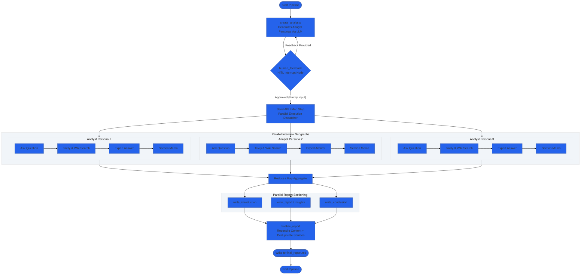

# 🤖 Multi-Agent Research Assistant with LangGraph

> An end-to-end, multi-agent research engine that orchestrates dynamic persona generation, **Human-in-the-Loop (HITL)** editorial steering, concurrent web/academic grounding, and map-reduce report synthesis using **LangGraph**.

---

## 📑 Table of Contents

* [Overview](https://www.google.com/search?q=%23-overview)
* [Key Highlights](https://www.google.com/search?q=%23-key-highlights)
* [System Architecture](https://www.google.com/search?q=%23-system-architecture)
* [Project Layout](https://www.google.com/search?q=%23-project-layout)
* [Prerequisites & Tools](https://www.google.com/search?q=%23-prerequisites--tools)
* [Quickstart Guide](https://www.google.com/search?q=%23-quickstart-guide)
* [Interactive Workflow](https://www.google.com/search?q=%23-interactive-workflow)
* [Configuration & Customization](https://www.google.com/search?q=%23-configuration--customization)
* [Output Format](https://www.google.com/search?q=%23-output-format)

---

## 🌟 Overview

The **Multi-Agent Research Assistant** automates the deep-dive research lifecycle. Instead of relying on a single prompt-response loop, the system simulates a full research team:

1. **The Lead Editor** breaks down a topic and provisions specialist analyst personas.
2. **The User (HITL)** reviews, refines, approves, or redirects the analyst squad before execution continues.
3. **The Specialists** execute independent parallel subgraphs, grilling simulated domain experts grounded via **Tavily Web Search** and **Wikipedia**.
4. **The Synthesis Engine** executes map-reduce aggregation, reconciling contradictions, consolidating deduplicated citations, and rendering an executive report.

---

## ✨ Key Highlights

| Feature | Implementation | Description |
| --- | --- | --- |
| **Dynamic Personas** | `Pydantic` + Structured Outputs | Generates high-context analyst identities (name, role, affiliation, bias/focus) tailored to themes. |
| **Human-in-the-Loop** | LangGraph `interrupt_before` | Suspends execution to state memory (`MemorySaver`), accepting feedback to rewrite personas on the fly. |
| **Scatter-Gather (Map-Reduce)** | LangGraph `Send()` API | Dispatches isolated interview graphs concurrently for all personas, cutting total latency. |
| **Multi-Source Grounding** | `TavilySearch` + `WikipediaLoader` | Queries both live real-time web results and deep encyclopedic context per interview turn. |
| **Deduplicated Citations** | Automated Markdown Synthesizer | Combines interview memos, extracts inline references (`[1]`, `[2]`), and merges sources into a master ledger. |

---

## 📐 System Architecture



---

## 📂 Project Layout

```text
multi-agent-research-assistant/
├── .env.example              # Template for API credentials
├── .gitignore                # Production ignore patterns (cache, env, checkpoints)
├── README.md                 # System overview and instructions
├── requirements.txt          # Pinned runtime dependencies
├── main.py                   # Terminal interface & execution runner
└── src/
    ├── __init__.py           # Package marker
    ├── config.py             # Model initializations & environment setup
    ├── models.py             # Pydantic models & LangGraph TypedDict states
    ├── prompts.py            # System prompts for personas, search, & drafting
    ├── tools.py              # Search integrations (Tavily & Wikipedia)
    ├── graph.py              # Core multi-agent StateGraph orchestrator
    └── subgraphs/
        ├── __init__.py       # Subgraph package marker
        └── interview.py      # Independent Q&A interview engine

```

---

## 🛠 Prerequisites & Tools

* **Python**: Version `3.10` or higher
* **OpenAI API Key**: Used with `gpt-4o-mini` (or standard `gpt-4o`)
* **Tavily API Key**: Real-time web grounding engineered for agentic applications

---

## 🚀 Quickstart Guide

### 1. Clone & Set Up Environment

```bash
# Clone the repository
git clone https://github.com/SKR18156592/multi-agent-research-assistant.git
cd multi-agent-research-assistant

# Create virtual environment
python -m venv venv

# Activate virtual environment
# macOS/Linux:
source venv/bin/activate
# Windows:
# venv\Scripts\activate

```

### 2. Install Dependencies

```bash
pip install --upgrade pip
pip install -r requirements.txt

```

### 3. Configure API Credentials

Copy `.env.example` to `.env` and fill in your keys:

```bash
cp .env.example .env

```

Edit `.env`:

```env
OPENAI_API_KEY="sk-proj-..."
TAVILY_API_KEY="tvly-..."
OPENAI_MODEL="gpt-4o-mini"

```

### 4. Run the Engine

```bash
python main.py

```

---

## 💬 Interactive Workflow

```text
Enter research topic: The impact of Small Language Models (SLMs) in on-device AI

[+] Initializing analyst generation for: 'The impact of Small Language Models (SLMs) in on-device AI'...

Generated 3 Analyst Personas:
- Dr. Kevin Vance (Edge Compute Engineer | Embedded Systems Corp.)
  Focus: Hardware acceleration, memory limits, and NPU performance benchmarks.

- Priya Sharma (Product Lead | NextGen Mobile AI)
  Focus: Battery life consumption, latency in real-time UX, and app adoption.

- Marcus Brody (Cybersecurity & Compliance Director | EdgeSec)
  Focus: Local data privacy, on-device encryption, and vulnerability to extraction attacks.

Provide feedback on personas (Press Enter to approve & continue): 

```

### Human-in-the-Loop Options:

* **To Approve**: Press **Enter** on an empty line. The system immediately kicks off the concurrent interview pipelines.
* **To Steer / Modify**: Type specific instructions.
```text
> Replace the product lead with an open-source model optimization researcher specializing in quantization (GGUF/AWQ).

```


The LLM updates the personas to match your feedback and displays them again for confirmation.

---

## ⚙️ Configuration & Customization

* **Adjust Persona Count**: Edit `max_analysts = 3` inside `main.py` to scale your specialist team up or down.
* **Interview Turns**: In `src/subgraphs/interview.py`, set `max_num_turns` (default: `2`) to expand the depth of questions per analyst.
* **Search Density**: Adjust `max_results` in `src/tools.py` for `TavilySearch` (default: `3`) or `load_max_docs` for `WikipediaLoader` (default: `2`).
* **Model Selection**: Switch between `gpt-4o-mini` and `gpt-4o` in `.env` or `src/config.py`.

---

## 📄 Output Format

Upon pipeline completion, the synthesized document is written to `final_report.md`:

```markdown
# [Dynamic Engaging Title Generated from Topic]

## Introduction
[Crisp ~100-word overview previewing key takeaways from all domains]

---

## Insights
[Deep-dive synthesis synthesizing evidence from each analyst interview memo]
- Cross-examination of technical performance [1]
- Economic and operational trade-offs [2]
- Regulatory compliance and risk analysis [3]

---

## Conclusion
[Executive synthesis framing future outlook and strategic roadmap]

## Sources
[1] https://tavily.com/...
[2] https://en.wikipedia.org/...
[3] https://docs.langchain.com/...

```